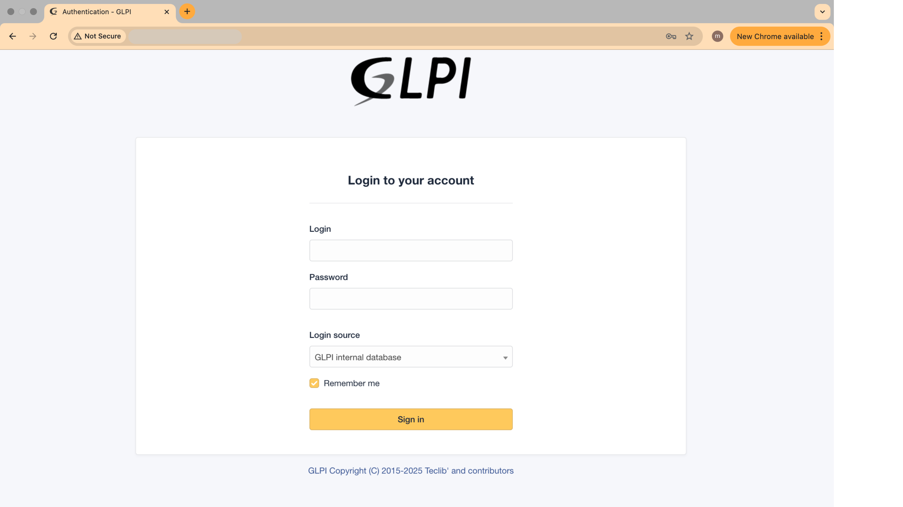
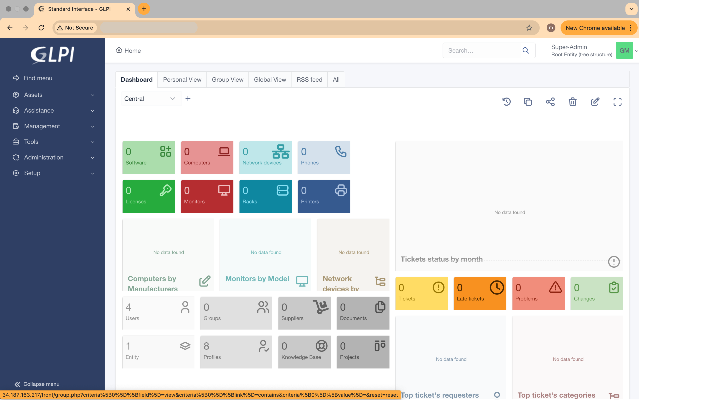

# GLPI IT Asset Management (ITAM) – Monolithic Deployment on GCP Free Tier
This documentation explains how to deploy GLPI as an IT Asset Management (ITAM) & ITSM solution on a single VM using GCP Always Free Tier (e2-micro).
Suitable for student projects, learning environments, or light internal usage with zero operational cost.

## Table of Contents 📝
1. [Architecture Overview](#1-architecture-overview)
2. [GCP Provisioning](#2-gcp-provisioning-%EF%B8%8F)
3. [Server Setup](#3-server-setup-)
4. [GLPI Application Setup](#4-glpi-application-setup-)
5. [Final Web Installation and Security](#5-final-web-installation-and-security)

---

# 1. Architecture Overview
This deployment uses a **monolithic architecture**, meaning all components (Web Server, Application, and Database) are installed on one Virtual Machine (VM). This architecture places all components on a single VM. This is the cheapest method but the least performant.

| Component |         Technology         |                       Status                       |
|-----------|----------------------------|----------------------------------------------------|
| Compute   | GCP e2-micro VM            | 1 vCPU, 1GB RAM (FREE TIER)                        |
| OS        | Ubuntu 22.04 LTS           | Standard, Stable Linux OS.                         |
| Web Stack | LEMP (NGINX, PHP 8.1-FPM)  | Serves the GLPI application                        |
| Database  | MySQL Server 8             | Installed and running on ```localhost``` (same VM) |
### Critical Trade-Offs
Running GLPI on a single free-tier VM keeps everything free, but it comes with real limitations. It’s perfectly fine for testing, learning, or small internal use but it sacrifices speed, encryption, and uptime guarantees.

|   Requirement   |             Status             |                 Reason                 |
|-----------------|--------------------------------|----------------------------------------|
| Performance     | Limited                        | 1GB RAM shared between app & DB        |
| Security(HTTPS) | No HTTPS                       | Domain + SSL needed for encryption     |
| Reliability     | Single Point of Failure (SPOF) | If the VM fails, the application & database is down. |

---

# 2. GCP Provisioning ☁️

All commands below are executed in **GCP Cloud Shell**.

### 2.1. Initial Setup & Firewall
- **Set Project and Enable API:** Replace ```[YOUR_PROJECT_ID]``` with your project ID.
  ```bash
  gcloud config set project [YOUR_PROJECT_ID]
  gcloud services enable compute.googleapis.com
  ```
- **Create SSH Key:** This key will be injected into the VM for secure access.
  ```bash
  ssh-keygen -t rsa -b 2048 -C "gcp-glpi-admin" -f ~/.ssh/gcp_rsa
  ```
- **Create Firewall Rules:** We allow HTTP (Port 80) and secure SSH access (Port 22).
  ```bash
  # Allow HTTP (for public access)
  gcloud compute firewall-rules create allow-http --allow=tcp:80 --target-tags=allow-web
  
  # Allow SSH only from your current Public IP (High Security)
  gcloud compute firewall-rules create allow-ssh --allow=tcp:22 --source-ranges=$(curl -s ifconfig.me)/32 --target-tags=allow-ssh
  ```

### 2.2. Create the Free-Tier VM
This command creates the VM with the necessary tags and configuration.
```bash
# Set a free tier zone (choose one: us-west1-a, us-central1-a, us-east1-a)
export GCP_ZONE="us-west1-a"

gcloud compute instances create glpi-server \
    --machine-type=e2-micro \
    --zone=$GCP_ZONE \
    --image-family=ubuntu-2204-lts \
    --image-project=ubuntu-os-cloud \
    --boot-disk-size=30GB \
    --boot-disk-type=pd-standard \
    --tags=allow-web,allow-ssh \
    --metadata-from-file=ssh-keys=/home/[YOUR_USERNAME]/.ssh/gcp_rsa.pub
```

---

# 3. Server Setup 🔧

### 3.1. Connect to VM
After the VM is created, connect using the external IP address.
```bash
# Get the ephemeral IP address
export VM_IP=$(gcloud compute instances describe glpi-server --zone=$GCP_ZONE --format='get(networkInterfaces[0].accessConfigs[0].natIP)')

# Connect to the VM (use your Cloud Shell username)
ssh -i ~/.ssh/gcp_rsa [YOUR_USERNAME]@$VM_I
```

### 3.2. System Update & Swap File (Performance Fix)
This is the key step to avoid OOM errors on the 1GB VM.
```bash
sudo apt update && sudo apt upgrade -y

# Create a 1GB swap file
sudo fallocate -l 1G /swapfile
sudo chmod 600 /swapfile
sudo mkswap /swapfile
sudo swapon /swapfile

# Make the swap permanent
echo '/swapfile none swap sw 0 0' | sudo tee -a /etc/fstab
```

### 3.3. Install Dependencies
```bash
sudo apt install -y nginx mysql-server php8.1-fpm \
                   php8.1-mysql php8.1-curl php8.1-gd \
                   php8.1-intl php8.1-mbstring php8.1-xml \
                   php8.1-zip php8.1-bz2 php8.1-ldap \
                   php8.1-apcu php8.1-xmlrpc
```

### 3.4. Configure Local MySQL
We set up the database and the required ```glpi_user``` for the application.
- Secure MySQL: Set the root password (needed for future maintenance).
  ```bash
  sudo mysql_secure_installation
  ```

- Create GLPI Database and User: Replace ```YOUR_GLPI_DB_PASSWORD```.
  - Note: We connect via ```sudo``` to bypass the root password prompt and use the local socket for security.
  ```bash
  # You will see the "mysql>" prompt immediately
  sudo mysql -u root
  
  # Inside the MySQL prompt, run these commands:
  CREATE DATABASE glpidb;
  CREATE USER 'glpi_user'@'localhost' IDENTIFIED BY 'YOUR_GLPI_DB_PASSWORD';
  GRANT ALL PRIVILEGES ON glpidb.* TO 'glpi_user'@'localhost';
  FLUSH PRIVILEGES;
  EXIT;
  ```

---

# 4. GLPI Application Setup 📦

### 4.1. Download and Permissions
```bash
cd /tmp

# Download the latest stable version (using 10.0.18 for this guide)
wget [https://github.com/glpi-project/glpi/releases/download/10.0.18/glpi-10.0.18.tgz](https://github.com/glpi-project/glpi/releases/download/10.0.18/glpi-10.0.18.tgz)

tar -xzvf glpi-10.0.18.tgz
sudo mv glpi /var/www/glpi

# Set ownership to the web server user
sudo chown -R www-data:www-data /var/www/glpi
sudo chmod -R 755 /var/www/glpi
```

### 4.2. Configure NGINX
This configuration block is essential and corrects the routing errors (404 Not Found after login) faced in earlier attempts.
- Optimize PHP-FPM: Adjust for low RAM.
  ```bash
  sudo nano /etc/php/8.1/fpm/pool.d/www.conf
  # Find pm = dynamic and change to pm = ondemand
  # Set pm.max_children = 5
  ```
- Create NGINX Configuration File:
  ```bash
  sudo nano /etc/nginx/sites-available/glpi.conf
  ```

  Paste the following, using the ```server_name_``` directive to accept the IP address:
  ```bash
  server {
    listen 80;
    server_name _;

    root /var/www/glpi/public;
    index index.php;

    location / {
        try_files $uri $uri/ /index.php$is_args$args;
    }

    location ~ \.php$ {
        location ~ ^/install {
            alias /var/www/glpi/install;
        }
        include snippets/fastcgi-php.conf;
        fastcgi_pass unix:/run/php/php8.1-fpm.sock;
        fastcgi_param SCRIPT_FILENAME $document_root$fastcgi_script_name;
        fastcgi_read_timeout 300;
    }
    location ~ /(config|files|locales|sql|vendor|inc) {
        deny all;
    }
    location ~ /\.env {
        deny all;
    }
  }
  ```
- Activate and Restart NGINX:
  ```bash
  sudo ln -s /etc/nginx/sites-available/glpi.conf /etc/nginx/sites-enabled/
  sudo rm /etc/nginx/sites-enabled/default
  
  sudo nginx -t
  sudo systemctl restart nginx
  sudo systemctl restart php8.1-fpm
  ```

### 4.3. Set Permissions and Cron
```bash
# Set ownership to the web server user
sudo chown -R www-data:www-data /var/www/glpi
sudo chmod -R 755 /var/www/glpi

# Set up cron job for GLPI tasks (mail, actions)
sudo nano /etc/cron.d/glpi
# Paste: */2 * * * * www-data /usr/bin/php /var/www/glpi/front/cron.php &>/dev/null
```

---

# 5. Final Web Installation and Security
- **Access the Installer:** Open your web browser and navigate to http://[YOUR_VM_IP_ADDRESS].
- Follow the steps until you reach the **Database Connection** page.
- **Enter Credentials:**
  - SQL server: localhost
  - SQL user: glpi_user
  - SQL password: YOUR_GLPI_DB_PASSWORD
- Finish the installation and immediately change the default passwords (glpi/glpi, tech/tech, etc.).
- After installation you should see:
  <table>
    <tr>
      <td align="center"><b>GLPI Login Page</b></td>
      <td align="center"><b>GLPI Dashboard</b></td>
    </tr>
    <tr>
      <td align="center">
        
      </td>
      <td align="center">
        
      </td>
    </tr>
  </table>

### Final Security and Documentation Step
- Remove Installer File: (Prevents security vulnerability)
  ```bash
  sudo rm /var/www/glpi/install/install.php
  ```
- Record Final IP: Note the external IP address of your VM for future access.

# Summary 📌
| Category                  | Status                                           |
|---------------------------|--------------------------------------------------|
| Cost                      | Free Tier eligible                               |
| Performance               | Limited by shared resources                      |
| Security                  | No HTTPS (optional improvement available)        |
| Use Case                  | Student projects / learning environments         |
